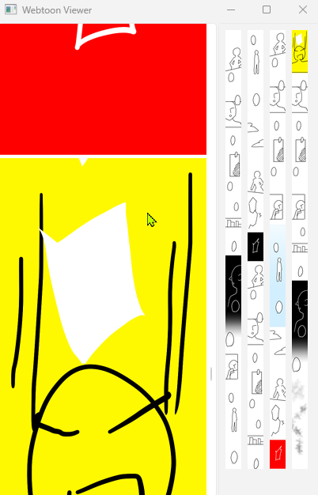

# WebtoonViewer
 

## アプリ概要
Webtoon形式（縦スクロール漫画）の画像フォルダを
縦に連結しスマートフォンの比率で高速に閲覧するシンプルなビューア。

## 主な機能
- フォルダ内画像の縦スクロール閲覧
- ホイールスクロール
- ドラッグスクロール
- ホイール慣性スクロール
- スクロール設定変更
- フォルダ履歴（最大10件）
- 右クリックメニュー
- フォルダリロード

## 起動方法

### Python版
1 Python をインストール
2 必要ライブラリをインストール

pip install -r requirements.txt

3 アプリ起動

python main.py

### EXE版
[release](https://github.com/chchannel/webtoon_viewer/releases)から最新版のWebtoonViewer.exeをダウンロード。

ダブルクリックして起動。

初回起動時に以下の設定ファイルが
exe と同じフォルダに自動生成されます。

settings.json
folder_history.json

## 操作方法
右クリック → スクロール設定
右クリック → フォルダをリロード

## スクロール設定
ホイール速度
ホイールスクロールの移動量

ホイール慣性
スクロール後に続く慣性量

ホイール減速
慣性スクロールの減衰率

ドラッグ速度
ドラッグスクロールの移動倍率

## ビルド方法
PyInstaller を使用

python -m PyInstaller --onefile --noconsole --icon=wtv.ico --name WebtoonViewer main.py

生成ファイル

dist/WebtoonViewer.exe

## ライセンス
このソフトウェアは Non-Commercial License（MITベース） で公開されています。
詳細は [LICENSE](https://github.com/chchannel/webtoon_viewer/blob/main/LICENSE) ファイルを参照してください。
